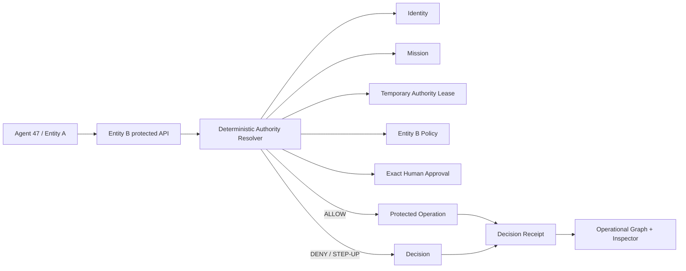

# QALAA — Cross-Agency AI Authority for Agentic Government

> **Security & Governance track.** QALAA is a working, server-enforced prototype for governing temporary AI-agent authority across organizational boundaries.

**Core thesis:** as government becomes agentic, authority has to become executable.

QALAA addresses a specific governance problem: when an AI agent from **Entity A** needs to operate on systems owned by **Entity B**, Entity A cannot safely grant itself access to Entity B. The receiving organization must retain independent control over **scope, policy, human approval, expiry, and revocation**.

This repository contains a working synthetic demo of that authority boundary.

---

## Judge / evaluator fast path

If you are reviewing this repository manually or with an automated agent, start here:

1. Read the **product proof loop** below.
2. Inspect `src/lib/resolver.ts` — this is the single deterministic authorization path used by protected Entity B operations.
3. Inspect `tests/protected-api.test.ts` and `tests/proposal.test.ts`.
4. Run `npm test`.
5. Start the app and run `scripts/acceptance.sh` against it.
6. For a deeper evidence map, read **[JUDGING.md](./JUDGING.md)**.

The most important claim in QALAA is not visual. It is behavioral:

```text
same protected endpoint:
403  →  200  →  403
 no       temporary     revoked
authority   authority   authority
```

That transition is produced by server-side authority state, not mocked client state.

---

## The product proof loop

The demo models a synthetic cyber incident involving:

- **Entity A** — requesting agency
- **Entity B** — resource-owning agency
- **Entity C** — uninvolved agency
- **Agent 47** — autonomous response agent belonging to Entity A
- **Incident 024** — declared high-severity cyber incident
- **Security Telemetry** — Entity B resource that may be delegated
- **Connector B-17** — Entity B resource with a human-gated critical action
- **Citizen Records** — Entity B resource class that is never delegated

The end-to-end flow is:

```text
RESET
  ↓
Agent 47 requests Entity B telemetry
  → 403 MISSION_NOT_DECLARED / NO_ACTIVE_LEASE

Entity A declares Incident 024
  ↓
Governance layer proposes a bounded temporary lease
  ↓
Entity A approves
  → telemetry is STILL 403 RECEIVER_NOT_ACCEPTED

Entity B independently accepts under its own policy ceiling
  → telemetry becomes 200 ALLOW

Agent 47 requests citizen records
  → 403 RESOURCE_CLASS_DENIED

Agent 47 requests ISOLATE_CONNECTOR on B-17
  → 409 HUMAN_APPROVAL_REQUIRED

Entity B issues an exact, one-use approval
  → resolver rechecks current state
  → connector mutates ACTIVE → ISOLATED exactly once

Entity B revokes the lease
  → active authority graph edges disappear
  → same telemetry endpoint becomes 403 AUTHORITY_REVOKED
```

This is the central demonstration: **the requesting entity may authorize the mission, but the receiving entity controls its resources.**

---

## Why this is different from “another agent dashboard”

QALAA is not primarily an observability layer.

It is an **enforcement layer**.

The graph and command center visualize operational state, but authority is determined by a server-side resolver at the protected-resource boundary.

The resolver checks, in order:

```text
server-issued identity
→ endpoint-bound resource/action
→ receiving-entity policy
→ mission state and purpose
→ lease binding
→ lease status / expiry / revocation
→ issuer approval
→ receiver acceptance
→ receiver policy ceiling
→ lease scope
→ exact human approval when required
→ pre-mutation recheck
→ protected action
→ decision receipt
```

A client cannot make itself authorized by changing UI state.

---

## Two-sided authority

A central design rule is:

> **The issuer cannot unilaterally grant authority inside the receiver's trust domain.**

Entity A can:

- declare the mission
- create/approve a bounded lease proposal
- revoke its own participation

Entity B independently controls:

- whether the lease is accepted
- which scopes survive its policy ceiling
- which resource classes are denied
- which actions require human step-up
- whether authority is revoked

The code explicitly tests that **Entity A cannot accept on Entity B's behalf**.

---

## Human governance for critical actions

Reading telemetry and isolating infrastructure are deliberately different.

A temporary lease may include `ISOLATE_CONNECTOR`, but Entity B policy marks that action **human-gated**.

An isolation request without an exact approval returns:

```text
409 HUMAN_APPROVAL_REQUIRED
```

The approval is bound to:

- lease ID
- lease version
- mission
- agent
- exact action
- exact resource
- approver
- expiry
- one-use consumption state

Immediately before mutation, QALAA re-evaluates the complete authority chain inside the same serialized transaction.

That protects against stale approvals and state changes between approval and execution.

---

## The model can propose authority. It cannot grant it.

QALAA optionally uses a bounded model call to draft the **minimum useful temporary mandate**.

But the model is never part of the authorization decision.

A model cannot:

- activate a lease
- approve for Entity A
- accept for Entity B
- override Entity B policy
- grant a denied resource class
- waive a human gate
- ignore expiry
- ignore revocation
- execute a protected action

Model output is schema-validated and re-applied against the receiving policy.

If no model provider is configured, QALAA uses a deterministic **RULE FALLBACK** and labels it honestly.

This means the security architecture remains functional even when the model is unavailable.

---

## Decision lineage

Every protected attempt produces a server-side `DecisionRecord`, including:

- allow
- deny
- human-approval-required

Each receipt records the authority context used at decision time, including:

- request
- actor
- mission
- lease + lease version
- receiving policy + policy version
- resource + resource version
- action definition version
- human approval, when applicable
- decision
- reason
- HTTP status
- authority-path checks
- timestamp

The operational graph is a projection of this same server-owned state. It is not an independent source of truth.

---

## Architecture



### Main implementation surfaces

| Capability | Implementation |
|---|---|
| Domain model | `src/lib/domain/` |
| Server-owned state | `src/lib/db.ts`, `src/lib/store.ts` |
| Deterministic authorization | `src/lib/resolver.ts` |
| Protected Entity B operations | `src/lib/protected.ts` |
| Mission / lease / approval lifecycle | `src/lib/lifecycle.ts` |
| Bounded AI proposal + fallback | `src/lib/proposal.ts`, `src/lib/model.ts` |
| Graph projection / demo snapshot | `src/lib/snapshot.ts` |
| API boundary | `src/app/api/**` |
| Operational command center | `src/components/**` |
| Direct API tests | `tests/**` |
| Live acceptance gate | `scripts/acceptance.sh` |

---

## Security properties demonstrated

The prototype intentionally demonstrates concrete governance properties rather than only presenting a concept:

| Property | Evidence |
|---|---|
| Requesting entity cannot self-grant receiving-entity authority | Entity A acceptance attempt returns `403 ROLE_NOT_PERMITTED` |
| Issuer approval alone grants nothing | Telemetry remains `403 RECEIVER_NOT_ACCEPTED` |
| Receiver can constrain authority | Policy ceiling is re-applied on acceptance and on protected calls |
| Permanently denied resource class stays denied | Citizen records return `403 RESOURCE_CLASS_DENIED` |
| Critical action requires a human | Isolation returns `409 HUMAN_APPROVAL_REQUIRED` |
| Approval is exact and one-use | Bound to lease/version/mission/agent/action/resource and consumed |
| Mutation is re-authorized | Resolver performs pre-mutation recheck |
| Revocation takes immediate effect | Same telemetry endpoint becomes `403 AUTHORITY_REVOKED` |
| Stale client state cannot resurrect authority | Revoked lease remains denied even when stale lease data is supplied |
| UI graph reflects backend authority | Active authority edges disappear after revocation |
| AI failure does not weaken enforcement | Deterministic rule fallback; resolver never consults model |

---

## Why the use case matters

As AI agents move from answering questions to taking actions, the governance problem changes.

The difficult question is no longer only:

> “What is this agent allowed to do?”

It becomes:

> “Who is allowed to grant this agent temporary authority over another organization's resources, for what purpose, under whose policy, with which human gates, and how is that authority revoked?”

QALAA turns that question into an executable control plane.

A credible deployment path is incremental:

1. **shadow mode** — evaluate authority decisions without enforcing
2. **read-only protected operations** — e.g. security telemetry
3. **human-gated critical actions** — e.g. isolation/remediation
4. **broader cross-system federation** while preserving resource-owner control

QALAA is designed to complement existing identity, API gateway, SIEM, and data-platform infrastructure rather than replace all of it.

---

## Run locally

Requirements: modern Node.js / npm.

```bash
npm install
npm run dev
```

Open:

```text
http://localhost:3000
```

### Verification

```bash
npm run typecheck
npm run lint
npm test
npm run build
```

With the dev server running:

```bash
scripts/acceptance.sh
```

The acceptance gate exercises the real HTTP flow, including:

- initial denial
- issuer-only denial
- receiver activation
- allowed telemetry
- permanent citizen-data denial
- human step-up
- one-use approval
- exactly-once connector mutation
- revocation
- stale-client denial
- graph-edge removal
- reset

---

## API surface

### Protected Entity B operations

- `GET /api/entity-b/security-telemetry`
- `GET /api/entity-b/citizen-records`
- `GET /api/entity-b/connectors/b-17`
- `POST /api/entity-b/connectors/b-17/isolate`

### Authority lifecycle

- `POST /api/mission/declare`
- `POST /api/leases/propose`
- `POST /api/leases/issuer-approve`
- `POST /api/leases/receiver-accept`
- `POST /api/leases/receiver-reject`
- `POST /api/step-up/approve`
- `POST /api/leases/revoke`

### Demo state

- `POST /api/demo/session`
- `POST /api/demo/reset`
- `GET /api/demo/state`
- `GET /api/demo/step`

---

## Stack

- Next.js 16
- React 19
- TypeScript
- Tailwind CSS 4
- Node route handlers
- SQLite via `node:sqlite`
- Vitest

---

## Prototype honesty

This is a **synthetic hackathon prototype**, not a claim of production government deployment.

Synthetic names, incident data, agencies, policies, users, and resources are used throughout the demo.

The current identity mechanism uses server-issued opaque demo sessions; a production system would integrate enterprise identity, service identity, gateways, key management, and external audit infrastructure.

The prototype's purpose is to prove the authority model and enforcement loop end-to-end.

---

## One sentence

**QALAA lets a receiving organization accept, constrain, human-gate, audit, and instantly revoke an AI agent's temporary authority at the resource boundary where actions actually happen.**

For evaluator-oriented evidence and a rubric mapping, see **[JUDGING.md](./JUDGING.md)**.
